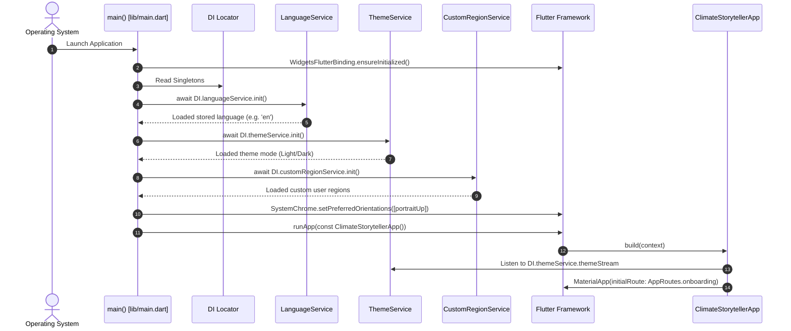
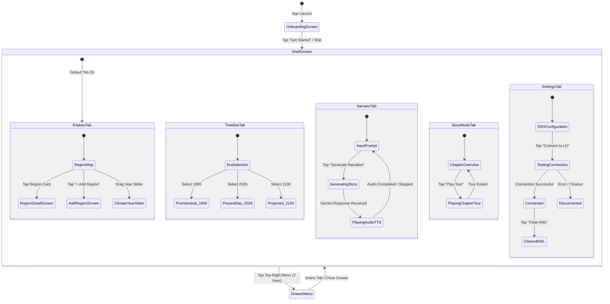
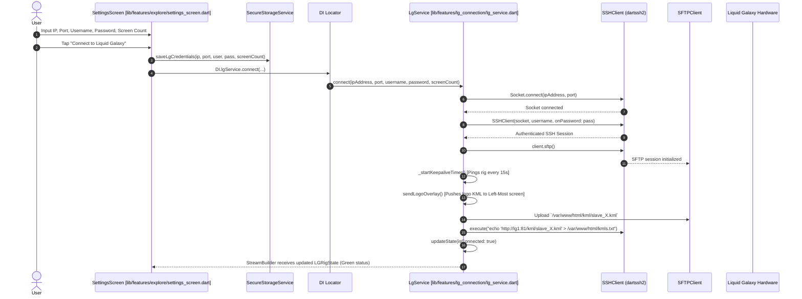
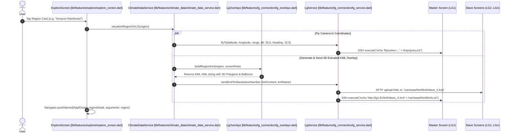
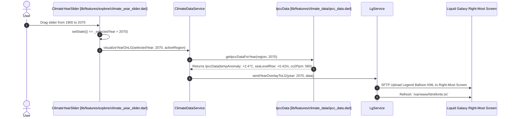
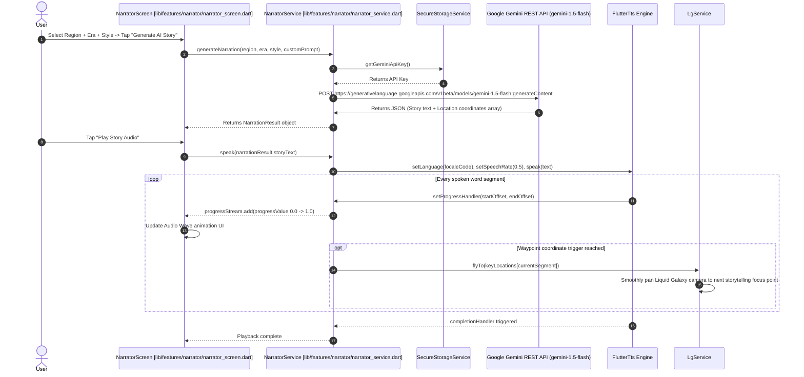
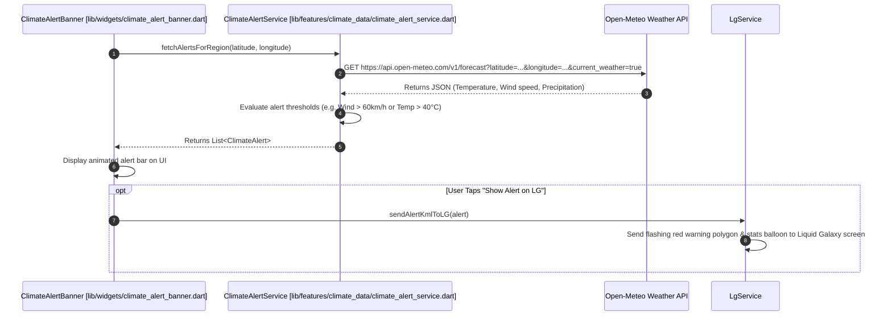
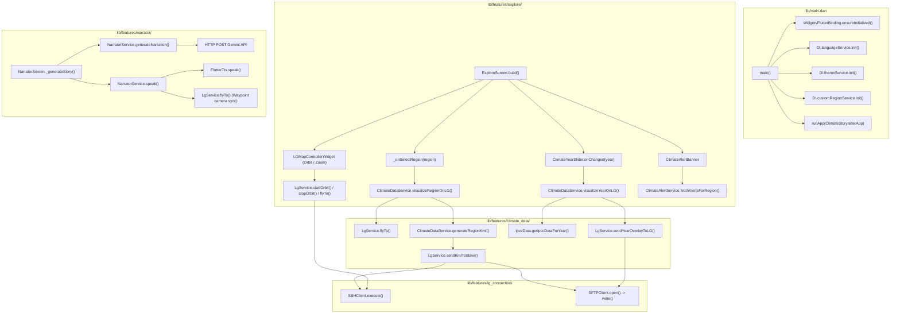
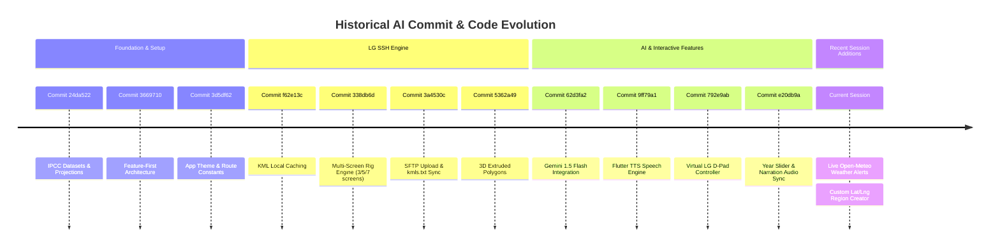

# Execution Flow & Architectural Sequence Map: Climate Storyteller

This document provides a **diagrammatic visual map** of execution flow, entry points, function call hierarchies, state propagation, and historical AI code changes in **Climate Storyteller**.

---

## 1. Complete System Architecture Overview

```mermaid
flowchart TB
    subgraph Boot ["1. Bootstrapping Layer"]
        A["main() [lib/main.dart]"]
        DI["DI Locator [lib/core/di/injection_container.dart]"]
    end

    subgraph CoreServices ["2. Singleton Service Layer"]
        LS["LanguageService\n(Localization & Stream)"]
        TS["ThemeService\n(Light/Dark & Stream)"]
        CRS["CustomRegionService\n(SharedPreferences)"]
        LGS["LgService\n(SSH / SFTP / Rig State)"]
        CDS["ClimateDataService\n(IPCC Data / KML Generation)"]
        NS["NarratorService\n(Gemini API & Flutter TTS)"]
        CAS["ClimateAlertService\n(Open-Meteo API Alerts)"]
    end

    subgraph UILayer ["3. User Interface Layer"]
        App["ClimateStorytellerApp"]
        Router["onGenerateRoute"]
        Onboarding["OnboardingScreen"]
        Shell["ShellScreen (IndexedStack & Drawer)"]

        subgraph NavigationTabs ["Tabs in ShellScreen"]
            Tab0["Tab 0: ExploreScreen\n(Map, Regions, Year Slider)"]
            Tab1["Tab 1: TimelineScreen\n(1900 -> 2026 -> 2100)"]
            Tab2["Tab 2: NarratorScreen\n(Gemini Prompt & TTS Wave)"]
            Tab3["Tab 3: StoryModeScreen\n(Automated Tour Chapters)"]
            Tab4["Tab 4: SettingsScreen\n(SSH Config & Rig Control)"]
        end

        subgraph ModalsScreens ["Sub-Screens & Modals"]
            RegionDetail["RegionDetailScreen"]
            AddRegion["AddRegionScreen"]
            AlertBanner["ClimateAlertBanner"]
        end
    end

    subgraph HardwareAPIs ["4. External Hardware & API Infrastructure"]
        LG1["Master Screen (LG1)\n/tmp/query.txt (FlyTo)"]
        LGScreens["Slave Screens (LG2..LGn)\n/var/www/html/kml/slave_X.kml"]
        GeminiAPI["Google Gemini 1.5 Flash API"]
        TTSEngine["Device TTS Engine"]
        WeatherAPI["Open-Meteo / NOAA / NASA GIBS"]
    end

    %% Boot Relationships
    A -->|1. Init Services| DI
    DI --> LS & TS & CRS & LGS & CDS & NS & CAS
    A -->|2. runApp()| App
    App --> Router
    Router -->|Initial Route| Onboarding
    Router -->|Main Flow| Shell

    %% UI Shell & Tabs
    Shell --> Tab0 & Tab1 & Tab2 & Tab3 & Tab4
    Tab0 --> RegionDetail & AddRegion & AlertBanner

    %% UI to Service Calls
    Tab0 -->|Select Region / Year| CDS
    Tab0 -->|Orbit / FlyTo Controls| LGS
    Tab1 -->|Select Era| CDS
    Tab2 -->|Generate Story| NS
    Tab3 -->|Next Chapter| NS & CDS
    Tab4 -->|Connect SSH| LGS
    AlertBanner -->|Fetch Live Weather| CAS

    %% Service to Hardware/API Connections
    CDS -->|Generate Overlay| LGS
    LGS -->|SSH command| LG1
    LGS -->|SFTP upload| LGScreens
    NS -->|HTTP POST| GeminiAPI
    NS -->|Audio Stream| TTSEngine
    CAS -->|HTTP GET| WeatherAPI
```

---

## 2. Bootstrapping & App Lifecycle Sequence



---

## 3. UI Navigation & Tab State Diagram



---

## 4. Function Call Chain Diagrams by Feature

### Feature Flow 1: Connecting to Liquid Galaxy Rig



---

### Feature Flow 2: Selecting a Region & Triggering 3D Visualizer



---

### Feature Flow 3: Climate Year Slider & Real-Time Data Propagation



---

### Feature Flow 4: Gemini AI Story Generation & Synchronized TTS Playback



---

### Feature Flow 5: Live Weather Alert Polling & Liquid Galaxy Notification



---

## 5. Detailed Function Call Graph (What Calls What)



---

## 6. Historical AI Session & Commit Modification Map



---

## 7. Master File & Function Directory

| File Path | Primary Class / Functions | Responsibilities |
| :--- | :--- | :--- |
| [`lib/main.dart`](file:///c:/climate_change_storyteller/lib/main.dart) | `main()`, `ClimateStorytellerApp` | Entry point, DI init, orientation lock, MaterialApp routing |
| [`lib/core/di/injection_container.dart`](file:///c:/climate_change_storyteller/lib/core/di/injection_container.dart) | `DI` | Service locator singleton instances |
| [`lib/features/lg_connection/lg_service.dart`](file:///c:/climate_change_storyteller/lib/features/lg_connection/lg_service.dart) | `LgService.connect()`, `flyTo()`, `sendKmlToSlave()` | SSH socket connection, SFTP file transfer, LG camera controls |
| [`lib/features/climate_data/climate_data_service.dart`](file:///c:/climate_change_storyteller/lib/features/climate_data/climate_data_service.dart) | `ClimateDataService.visualizeRegionOnLG()`, `visualizeYearOnLG()` | Regional climate aggregator & KML overlay generator |
| [`lib/features/narrator/narrator_service.dart`](file:///c:/climate_change_storyteller/lib/features/narrator/narrator_service.dart) | `NarratorService.generateNarration()`, `speak()` | Gemini API storytelling & Flutter TTS synchronized playback |
| [`lib/features/climate_data/climate_alert_service.dart`](file:///c:/climate_change_storyteller/lib/features/climate_data/climate_alert_service.dart) | `ClimateAlertService.fetchAlertsForRegion()` | Real-time Open-Meteo weather API polling & alert generation |
| [`lib/features/explore/explore_screen.dart`](file:///c:/climate_change_storyteller/lib/features/explore/explore_screen.dart) | `ExploreScreen`, `_onSelectRegion()` | Main map UI, region cards, climate timeline year slider |
| [`lib/features/explore/shell_screen.dart`](file:///c:/climate_change_storyteller/lib/features/explore/shell_screen.dart) | `ShellScreen`, `_AppNavigationDrawer` | Top bar, drawer navigation, 5-tab `IndexedStack` container |
